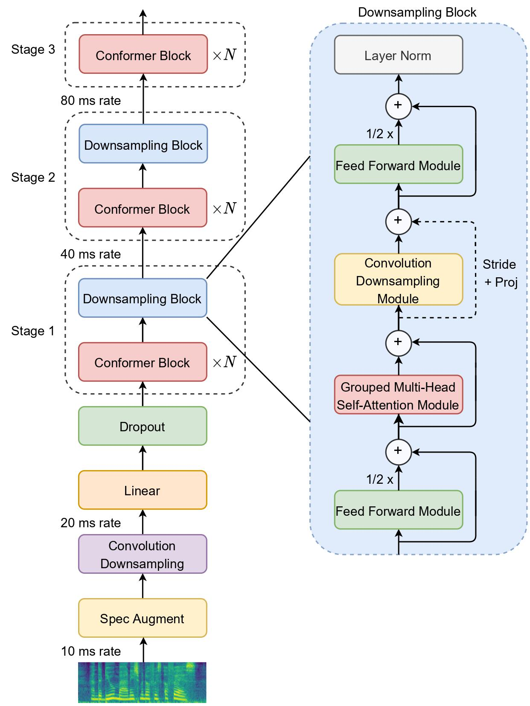
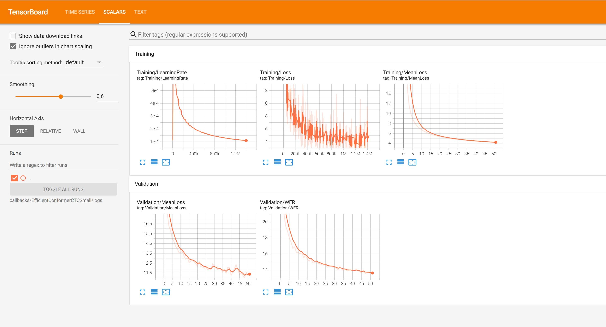

# Efficient Conformer: Progressive Downsampling and Grouped Attention for Automatic Speech Recognition [Paper](https://arxiv.org/abs/2109.01163)

## Efficient Conformer Encoder
Inspired from previous works done in Automatic Speech Recognition and Computer Vision, the Efficient Conformer encoder is composed of three encoder stages where each stage comprises a number of Conformer blocks using grouped attention. The encoded sequence is progressively downsampled and projected to wider feature dimensions, lowering  the amount of computation while achieving better performance. Grouped multi-head attention reduce attention complexity by grouping neighbouring time elements along the feature dimension before applying scaled dot-product attention.



## Installation
Clone GitHub repository and set up environment
```
git clone https://github.com/nguyenthienhy/EfficientConformerVietnamese.git
cd EfficientConformerVietnamese
pip install -r requirements.txt
pip install torch==1.11.0+cu113 torchvision==0.12.0+cu113 torchaudio==0.11.0 --extra-index-url https://download.pytorch.org/whl/cu113
pip install protobuf==4.25
```

Install [ctcdecode](https://github.com/parlance/ctcdecode)

## Prepare dataset and training pipline

Dataset to train this mini version:
- Vivos
- Vietbud_500
- VLSP2020, VLSP2021, VLSP2022
- VietMed_labeled
- Google Fleurs

Steps:

- Prepare a dataset folder that includes the data domains you want to train on, for example: ASRDataset/VLSP2020, ASRDataset/VLSP2021. Inside each VLSP2020 folder, there should be corresponding .wav and .txt files.
- Add noise to the audio using **add_noise.py**.
- Change the speaking speed using **speed_permutation.py**.
- Extract audio length and BPE tokens using **prepare_dataset.py**.
- Filter audio by the maximum length specified, using **filter_max_length.py**, and save the list of audio files used for training in a .txt file, for example: data/train_wav_names.txt.
- Train the model using **train.py** (please read the parameters carefully).
- Prepare a **lm_corpus.txt** to train **n gram bpe language model**, using **train_lm.py**

## Evaluation
Please read code carefully !
```
bash test.sh
```

## Monitor training

```
tensorboard --logdir callback_path
```



## Vietnamese Performance

| Model        			| Size     	| Type  | Params (M) | gigaspeech_test/vlsp2023_test_pb/vlsp2023_test_pr gready WER (%)| gigaspeech_test/vlsp2023_test_pb/vlsp2023_test_pr n-gram WER (%) | GPUs |
| :-------------------:	|:--------:	|:-----:|:----------:|:------:|:------:|:------:|
| Efficient Conformer	| Small		| CTC 	| 13.4  | 19.61 / 23.06 / 23.17 | 17.47 / 20.83 / 21.15 | 1 x RTX 3090 |

In the competition organized by VLSP, I used the Efficient Conformer Large architecture with approximately 127 million parameters. You can find the detailed results in the technical report below:
https://www.overleaf.com/read/nhqjtcpktjyc#3b472e

## Reference
[Maxime Burchi, Valentin Vielzeuf.	Efficient Conformer: Progressive Downsampling and Grouped Attention for Automatic Speech Recognition.](https://arxiv.org/abs/2109.01163)

* Maxime Burchi [@burchim](https://github.com/burchim)